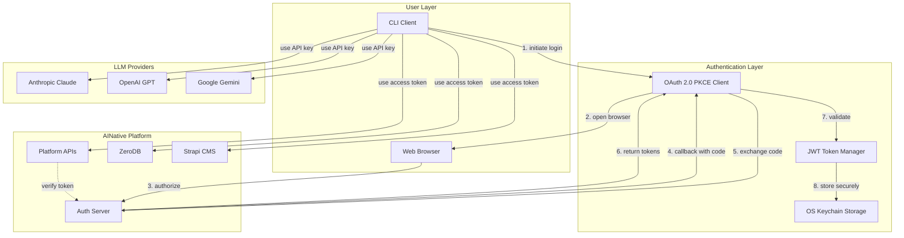
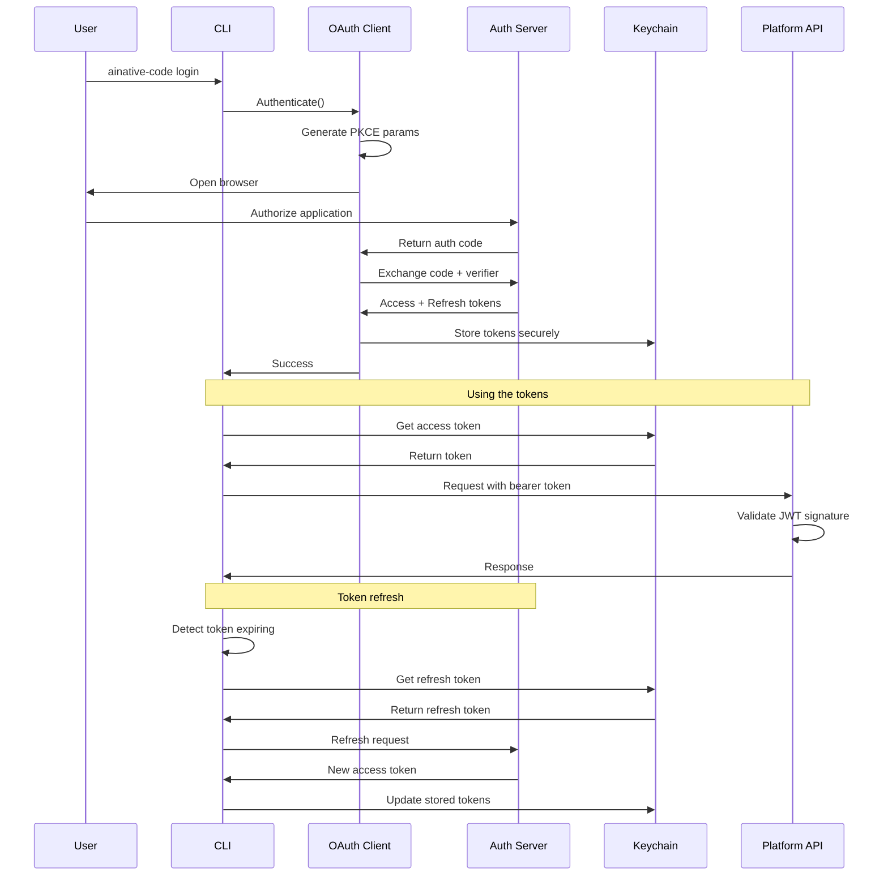

# Authentication System

## Overview

AINative Code implements a **three-tier validation system** that combines OAuth 2.0, JWT, and API key authentication to provide secure, flexible authentication for both the AINative platform and LLM providers.

### Authentication Tiers

1. **OAuth 2.0 with PKCE** - Secure user authentication for AINative platform services
2. **JWT Token Validation** - Fast, stateless API authentication with RS256 signature verification
3. **API Key Authentication** - Direct authentication for LLM provider APIs (Anthropic, OpenAI, etc.)

## Architecture Overview



## Security Model

### OAuth 2.0 PKCE Flow

**PKCE (Proof Key for Code Exchange)** prevents authorization code interception attacks by requiring the client to prove possession of a secret code verifier:

1. **Code Verifier**: 128-character cryptographically random string
2. **Code Challenge**: SHA-256 hash of verifier, base64url-encoded
3. **Authorization**: Client sends challenge (not verifier) to auth server
4. **Token Exchange**: Client proves possession by sending verifier

**CSRF Protection**: State parameter (32-byte random token) validates callback authenticity

### JWT Token Structure

**Access Token** (Short-lived: 1 hour)
- **Algorithm**: RS256 (RSA signature with SHA-256)
- **Claims**: `iss`, `aud`, `sub`, `exp`, `email`, `roles`
- **Purpose**: API authentication
- **Validation**: Signature verification, expiry check, issuer/audience validation

**Refresh Token** (Long-lived: 30 days)
- **Algorithm**: RS256
- **Claims**: `iss`, `aud`, `sub`, `exp`, `session_id`
- **Purpose**: Obtain new access tokens without re-authentication
- **Validation**: Signature verification, expiry check, session validation

### Secure Storage

Tokens are stored in OS-native secure storage:

- **macOS**: Keychain Access (encrypted, per-user)
- **Linux**: Secret Service API (gnome-keyring, kwallet)
- **Windows**: Credential Manager (DPAPI encryption)

**No plaintext token files** - all tokens encrypted at rest with OS-level access control.

## Token Lifecycle



### Token Refresh Strategy

**Automatic Refresh**: Access tokens are automatically refreshed when they:
- Have expired
- Will expire within 5 minutes (proactive refresh)

**Refresh Workflow**:
1. Client detects token expiration or nearing expiration
2. Retrieves refresh token from keychain
3. Sends refresh request to token endpoint
4. Receives new access token (and optionally new refresh token)
5. Updates keychain with new tokens

**Fallback**: If refresh fails (expired refresh token, revoked session), user must re-authenticate.

## Key Features

### Thread-Safe Operations
- Mutex-protected global keychain access
- Concurrent token refresh handling
- Race condition prevention

### Context-Aware
- All operations accept `context.Context`
- Cancellation support
- Timeout handling
- Request ID propagation

### Error Handling
- Comprehensive error types (see `/internal/auth/errors.go`)
- Error wrapping with `fmt.Errorf` and `%w`
- Detailed error messages
- Structured error codes

### Performance
- **PKCE Generation**: ~1ms (crypto/rand + SHA256)
- **JWT Validation**: ~2ms (RSA signature verification)
- **Keychain Operations**: 10-100ms (platform-dependent)
- **Zero allocations** for hot path token validation

## Implementation Files

### Core Authentication
- `/internal/auth/types.go` - Token structures and PKCE parameters
- `/internal/auth/interface.go` - Client interface definition
- `/internal/auth/pkce.go` - PKCE generation and validation
- `/internal/auth/jwt.go` - JWT parsing and validation
- `/internal/auth/errors.go` - Error type definitions

### OAuth Client
- `/internal/auth/oauth/client.go` - OAuth 2.0 PKCE flow implementation
- `/internal/auth/oauth/pkce.go` - PKCE parameter generation

### Keychain Storage
- `/internal/auth/keychain/keychain.go` - Keychain interface
- `/internal/auth/keychain/keychain_darwin.go` - macOS implementation
- `/internal/auth/keychain/keychain_linux.go` - Linux implementation
- `/internal/auth/keychain/keychain_windows.go` - Windows implementation

### CLI Commands
- `/internal/cmd/auth.go` - Authentication CLI commands

## Configuration

Configuration is loaded from `~/.config/ainative-code/config.yaml`:

```yaml
platform:
  oauth:
    client_id: "ainative-code-cli"
    auth_endpoint: "https://auth.ainative.studio/oauth/authorize"
    token_endpoint: "https://auth.ainative.studio/oauth/token"
    redirect_uri: "http://localhost:8080/callback"
    scopes:
      - "read"
      - "write"
      - "offline_access"
    timeout: 30s

  jwt:
    issuer: "ainative-auth"
    audience: "ainative-code"
    public_key_path: "~/.ainative/jwt-public.pem"

  keychain:
    service_name: "ainative-code"
    auto_refresh: true
    refresh_threshold: 5m
```

## Related Documentation

- [OAuth Flow Details](oauth-flow.md) - Detailed OAuth 2.0 PKCE flow documentation
- [User Guide](user-guide.md) - How to authenticate with the CLI
- [API Reference](api-reference.md) - Authentication API endpoints
- [Troubleshooting](troubleshooting.md) - Common issues and solutions
- [Security Best Practices](security-best-practices.md) - Security recommendations

## Standards Compliance

- **RFC 6749**: OAuth 2.0 Authorization Framework
- **RFC 7636**: Proof Key for Code Exchange (PKCE)
- **RFC 7519**: JSON Web Tokens (JWT)
- **RFC 4648**: Base64 Encoding (Section 5: Base64URL)
- **RFC 7515**: JSON Web Signature (JWS)
- **RFC 7517**: JSON Web Key (JWK)

## Security Considerations

1. **Never log tokens** - Tokens contain sensitive information
2. **Use HTTPS only** - All OAuth flows use HTTPS endpoints
3. **Validate state parameter** - Prevents CSRF attacks
4. **Verify JWT signatures** - Prevents token forgery
5. **Check token expiration** - Prevents replay attacks
6. **Use OS keychain** - Encrypted storage with access control
7. **Rotate refresh tokens** - Server may issue new refresh tokens
8. **Revoke on logout** - Clear keychain and revoke server sessions

## Testing

The authentication system has **80%+ test coverage** with comprehensive test suites:

- **Unit Tests**: PKCE generation, JWT parsing, token validation
- **Integration Tests**: OAuth flow, keychain operations, error handling
- **Security Tests**: Invalid state, expired tokens, signature verification
- **Concurrency Tests**: Thread-safe token storage and refresh

See test files in `/internal/auth/*_test.go` for implementation details.

## License

Copyright 2024 AINative Studio. All rights reserved.
MIT License - see LICENSE file for details.
