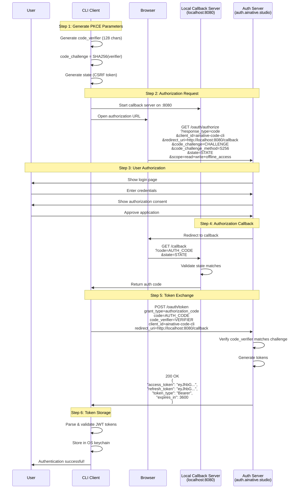
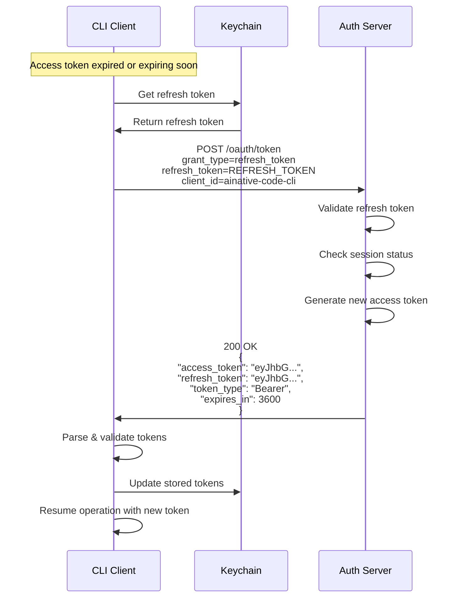

# OAuth 2.0 PKCE Flow

## Overview

AINative Code implements the **OAuth 2.0 Authorization Code Flow with PKCE** (Proof Key for Code Exchange) for secure user authentication. This flow provides:

- **Security**: PKCE prevents authorization code interception attacks
- **User Control**: Users authorize the application through a web browser
- **Token Management**: Automatic refresh and secure storage
- **Cross-Platform**: Works on macOS, Linux, and Windows

## PKCE Flow Diagram



## Step-by-Step Process

### Step 1: Generate PKCE Parameters

The CLI generates cryptographically secure random parameters:

```go
// Generate PKCE parameters
pkce, err := auth.GeneratePKCE()
if err != nil {
    return fmt.Errorf("PKCE generation failed: %w", err)
}

// pkce.CodeVerifier: 128-character random string
// Example: "dBjftJeZ4CVP-mB92K27uhbUJU1p1r_wW1gFWFOEjXk..."

// pkce.CodeChallenge: SHA-256 hash of verifier, base64url-encoded
// Example: "E9Melhoa2OwvFrEMTJguCHaoeK1t8URWbuGJSstw-cM"

// pkce.State: 32-byte random CSRF token
// Example: "xcoiv98y2kd22vusuye3kch"
```

**Security**:
- Code verifier uses `crypto/rand` for cryptographic randomness
- Challenge uses SHA-256 hashing (irreversible)
- State provides CSRF protection

### Step 2: Build Authorization URL

The CLI constructs the authorization URL with all required parameters:

```go
authURL := fmt.Sprintf("%s?%s",
    config.AuthEndpoint,
    url.Values{
        "response_type":         {"code"},
        "client_id":            {config.ClientID},
        "redirect_uri":         {config.RedirectURI},
        "code_challenge":       {pkce.CodeChallenge},
        "code_challenge_method": {"S256"},
        "state":                {pkce.State},
        "scope":                {strings.Join(config.Scopes, " ")},
    }.Encode(),
)
```

**Example URL**:
```
https://auth.ainative.studio/oauth/authorize
  ?response_type=code
  &client_id=ainative-code-cli
  &redirect_uri=http://localhost:8080/callback
  &code_challenge=E9Melhoa2OwvFrEMTJguCHaoeK1t8URWbuGJSstw-cM
  &code_challenge_method=S256
  &state=xcoiv98y2kd22vusuye3kch
  &scope=read+write+offline_access
```

### Step 3: Open Browser

The CLI starts a local callback server and opens the user's browser:

```go
// Start callback server
server := oauth.NewCallbackServer(8080)
if err := server.Start(ctx); err != nil {
    return fmt.Errorf("failed to start callback server: %w", err)
}
defer server.Close()

// Open browser to authorization URL
if err := browser.Open(authURL); err != nil {
    return fmt.Errorf("failed to open browser: %w", err)
}

fmt.Println("Opening browser for authentication...")
fmt.Println("Please complete the authorization in your browser")
```

**User Experience**:
1. Browser opens to AINative login page
2. User enters email and password
3. User sees authorization consent screen
4. User clicks "Authorize" button

### Step 4: Handle Callback

The local callback server receives the authorization code:

```go
// Wait for callback (with timeout)
result, err := server.Wait(ctx)
if err != nil {
    return fmt.Errorf("callback failed: %w", err)
}

// Validate state parameter (CSRF protection)
if result.State != pkce.State {
    return fmt.Errorf("invalid state parameter: CSRF check failed")
}

// Check for authorization errors
if result.HasError() {
    return fmt.Errorf("authorization denied: %s - %s",
        result.Error, result.ErrorDescription)
}

authCode := result.Code
```

**Callback URL**:
```
http://localhost:8080/callback
  ?code=SplxlOBeZQQYbYS6WxSbIA
  &state=xcoiv98y2kd22vusuye3kch
```

### Step 5: Exchange Code for Tokens

The CLI sends the authorization code and code verifier to get tokens:

```go
// Prepare token request
data := url.Values{
    "grant_type":    {"authorization_code"},
    "code":          {authCode},
    "code_verifier": {pkce.CodeVerifier},
    "client_id":     {config.ClientID},
    "redirect_uri":  {config.RedirectURI},
}

// Send request to token endpoint
req, _ := http.NewRequestWithContext(ctx, "POST", config.TokenEndpoint,
    strings.NewReader(data.Encode()))
req.Header.Set("Content-Type", "application/x-www-form-urlencoded")

resp, err := http.DefaultClient.Do(req)
if err != nil {
    return fmt.Errorf("token request failed: %w", err)
}
defer resp.Body.Close()

// Parse response
var tokenResp struct {
    AccessToken  string `json:"access_token"`
    RefreshToken string `json:"refresh_token"`
    TokenType    string `json:"token_type"`
    ExpiresIn    int64  `json:"expires_in"`
}

if err := json.NewDecoder(resp.Body).Decode(&tokenResp); err != nil {
    return fmt.Errorf("failed to parse token response: %w", err)
}
```

**Server-Side Validation**:
1. Server computes `SHA256(code_verifier)`
2. Compares result to stored `code_challenge`
3. Validates authorization code hasn't been used
4. Validates authorization code hasn't expired
5. Generates and signs JWT tokens

### Step 6: Validate and Store Tokens

The CLI validates JWT tokens and stores them securely:

```go
// Parse and validate access token
accessToken, err := auth.ParseAccessToken(tokenResp.AccessToken, publicKey)
if err != nil {
    return fmt.Errorf("invalid access token: %w", err)
}

// Parse and validate refresh token
refreshToken, err := auth.ParseRefreshToken(tokenResp.RefreshToken, publicKey)
if err != nil {
    return fmt.Errorf("invalid refresh token: %w", err)
}

// Create token pair
tokens := &auth.TokenPair{
    AccessToken:  accessToken,
    RefreshToken: refreshToken,
    ReceivedAt:   time.Now(),
}

// Store in OS keychain
kc := keychain.Get()
if err := kc.SetTokenPair(tokens); err != nil {
    return fmt.Errorf("failed to store tokens: %w", err)
}

fmt.Printf("✓ Authentication successful!\n")
fmt.Printf("Authenticated as: %s\n", accessToken.Email)
fmt.Printf("Access token expires in: %s\n", formatDuration(
    time.Until(accessToken.ExpiresAt)))
```

## Token Refresh Workflow

When the access token expires, the CLI automatically refreshes it:



**Code Example**:

```go
// Check if token needs refresh
if tokens.NeedsRefresh() {
    // Get refresh token from keychain
    kc := keychain.Get()
    currentTokens, err := kc.GetTokenPair()
    if err != nil {
        // No stored tokens, need to login
        return client.Authenticate(ctx)
    }

    // Refresh access token
    newTokens, err := client.RefreshToken(ctx, currentTokens.RefreshToken)
    if err != nil {
        // Refresh failed, need to re-authenticate
        return client.Authenticate(ctx)
    }

    // Update stored tokens
    if err := kc.SetTokenPair(newTokens); err != nil {
        log.Printf("Warning: failed to store refreshed tokens: %v", err)
    }

    tokens = newTokens
}
```

## Login Code Example

Complete example of the login process:

```go
package main

import (
    "context"
    "fmt"
    "time"

    "github.com/AINative-studio/ainative-code/internal/auth"
    "github.com/AINative-studio/ainative-code/internal/auth/oauth"
    "github.com/AINative-studio/ainative-code/internal/auth/keychain"
)

func login(ctx context.Context) error {
    // Configure OAuth client
    config := oauth.Config{
        AuthURL:     "https://auth.ainative.studio/oauth/authorize",
        TokenURL:    "https://auth.ainative.studio/oauth/token",
        ClientID:    "ainative-code-cli",
        RedirectURL: "http://localhost:8080/callback",
        Scopes:      []string{"read", "write", "offline_access"},
    }

    // Create OAuth client
    client := oauth.NewClient(config)

    // Set timeout for authentication (5 minutes)
    ctx, cancel := context.WithTimeout(ctx, 5*time.Minute)
    defer cancel()

    // Start authentication flow
    fmt.Println("Initiating authentication flow...")
    fmt.Println("A browser window will open for you to log in")

    tokens, err := client.Authenticate(ctx)
    if err != nil {
        return fmt.Errorf("authentication failed: %w", err)
    }

    // Store tokens in keychain
    kc := keychain.Get()
    if err := kc.SetTokenPair(tokens); err != nil {
        return fmt.Errorf("failed to store tokens: %w", err)
    }

    fmt.Printf("\n✓ Authentication successful!\n")
    fmt.Printf("Authenticated as: %s\n", tokens.AccessToken.Email)
    fmt.Printf("Token expires in: %s\n",
        time.Until(tokens.AccessToken.ExpiresAt))

    return nil
}
```

## Logout Code Example

Complete example of the logout process:

```go
func logout(ctx context.Context) error {
    kc := keychain.Get()

    // Clear all tokens from keychain
    if err := kc.DeleteAll(); err != nil {
        return fmt.Errorf("failed to clear tokens: %w", err)
    }

    fmt.Println("✓ Successfully logged out")
    fmt.Println("All credentials have been removed")

    return nil
}
```

## Error Handling

### Common Errors

**Authorization Denied**:
```go
if errors.Is(err, auth.ErrAuthorizationDenied) {
    fmt.Println("You denied the authorization request")
    fmt.Println("Please run 'ainative-code login' again to authenticate")
    return
}
```

**Authorization Timeout**:
```go
if errors.Is(err, auth.ErrAuthorizationTimeout) {
    fmt.Println("Authentication timed out")
    fmt.Println("Please complete the authorization within 5 minutes")
    return
}
```

**Invalid State (CSRF Attack)**:
```go
if errors.Is(err, auth.ErrInvalidState) {
    fmt.Println("Security error: invalid state parameter")
    fmt.Println("This may indicate a CSRF attack")
    return
}
```

**Code Exchange Failed**:
```go
if errors.Is(err, auth.ErrCodeExchangeFailed) {
    fmt.Println("Failed to exchange authorization code for tokens")
    fmt.Println("The authorization code may have expired")
    fmt.Println("Please try logging in again")
    return
}
```

## Security Considerations

### PKCE Protection

**Threat**: Authorization code interception attack
- Attacker intercepts authorization code from redirect
- Attacker attempts to exchange code for tokens

**Mitigation**: PKCE requires proof of possession
- Client generates random `code_verifier` (secret)
- Client sends `code_challenge = SHA256(verifier)` during authorization
- Server stores challenge with authorization code
- Client sends `code_verifier` during token exchange
- Server validates `SHA256(verifier) == challenge`
- Attacker without verifier cannot obtain tokens

### CSRF Protection

**Threat**: Cross-Site Request Forgery
- Attacker tricks user into authorizing malicious application
- Attacker steals authorization code via redirect

**Mitigation**: State parameter validation
- Client generates random state token
- Client includes state in authorization URL
- Server returns state in callback
- Client validates state matches original
- Mismatched state indicates potential CSRF attack

### Secure Callback Server

**Threat**: Malicious application on localhost intercepts callback
- Another application listens on port 8080
- Captures authorization code from redirect

**Mitigation**: Multiple layers of protection
- State validation prevents code use by other apps
- PKCE prevents token exchange without verifier
- Single-use callback server closes after one request
- Short-lived authorization codes (60 seconds)

## Performance Metrics

- **PKCE Generation**: ~1ms
- **Browser Open**: ~100ms (platform-dependent)
- **User Authorization**: User-dependent (typically 10-30 seconds)
- **Token Exchange**: ~200-500ms (network-dependent)
- **JWT Validation**: ~2ms (RSA signature verification)
- **Keychain Storage**: ~10-100ms (platform-dependent)

**Total Flow Duration**: Typically 15-45 seconds (mostly user interaction)

## References

- [RFC 6749: OAuth 2.0 Authorization Framework](https://tools.ietf.org/html/rfc6749)
- [RFC 7636: Proof Key for Code Exchange (PKCE)](https://tools.ietf.org/html/rfc7636)
- [RFC 7519: JSON Web Tokens (JWT)](https://tools.ietf.org/html/rfc7519)
- [OAuth 2.0 Security Best Current Practice](https://tools.ietf.org/html/draft-ietf-oauth-security-topics)

## Related Documentation

- [Authentication Overview](README.md)
- [User Guide](user-guide.md)
- [Troubleshooting](troubleshooting.md)
- [Security Best Practices](security-best-practices.md)
