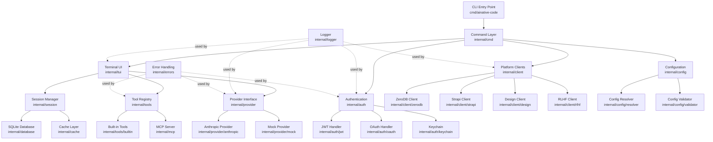
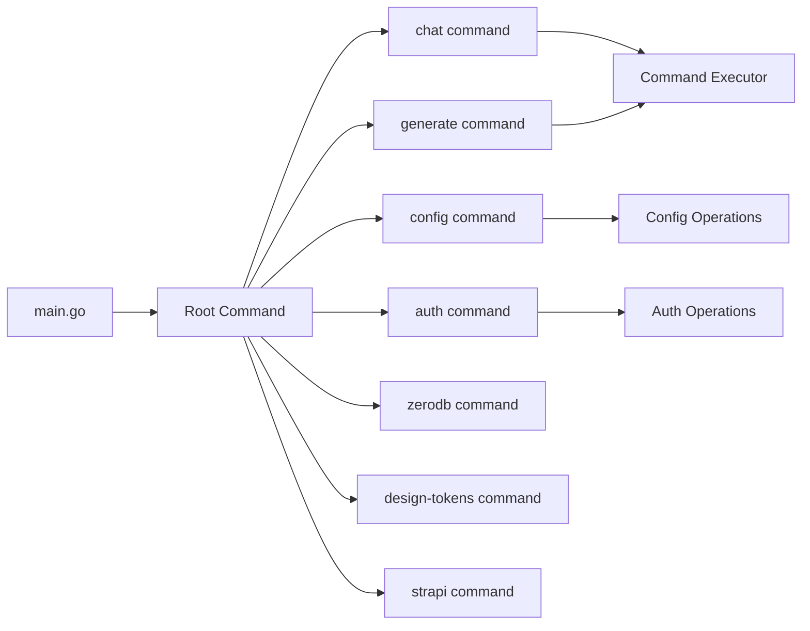
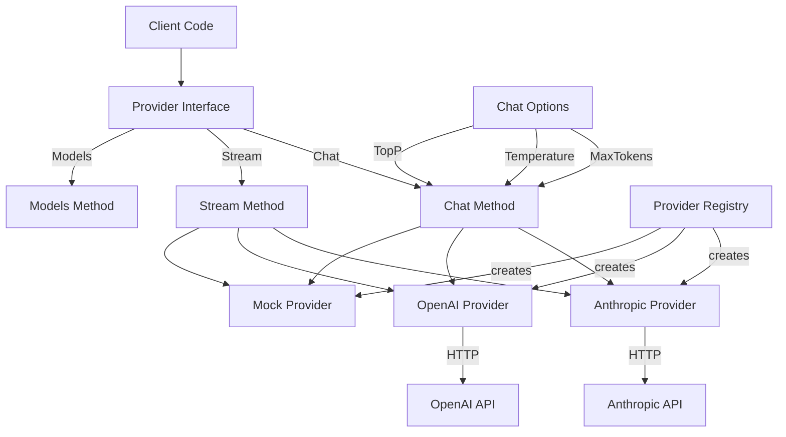
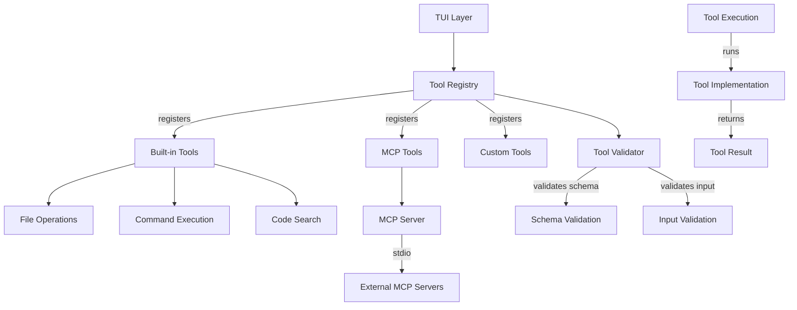
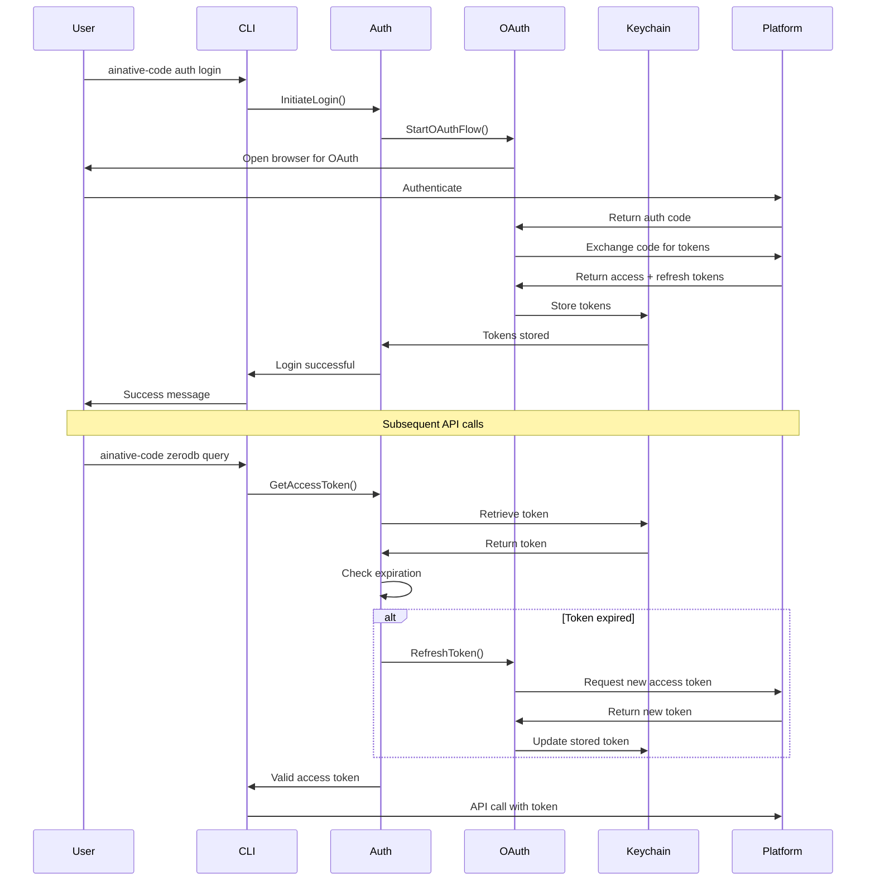
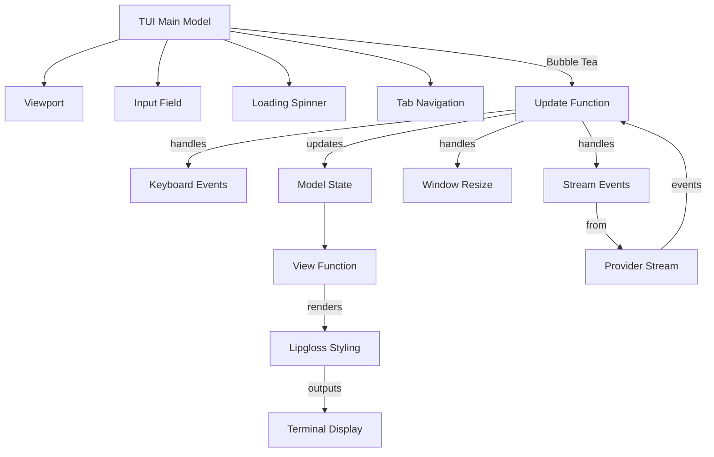
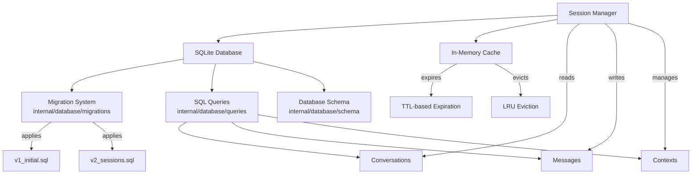
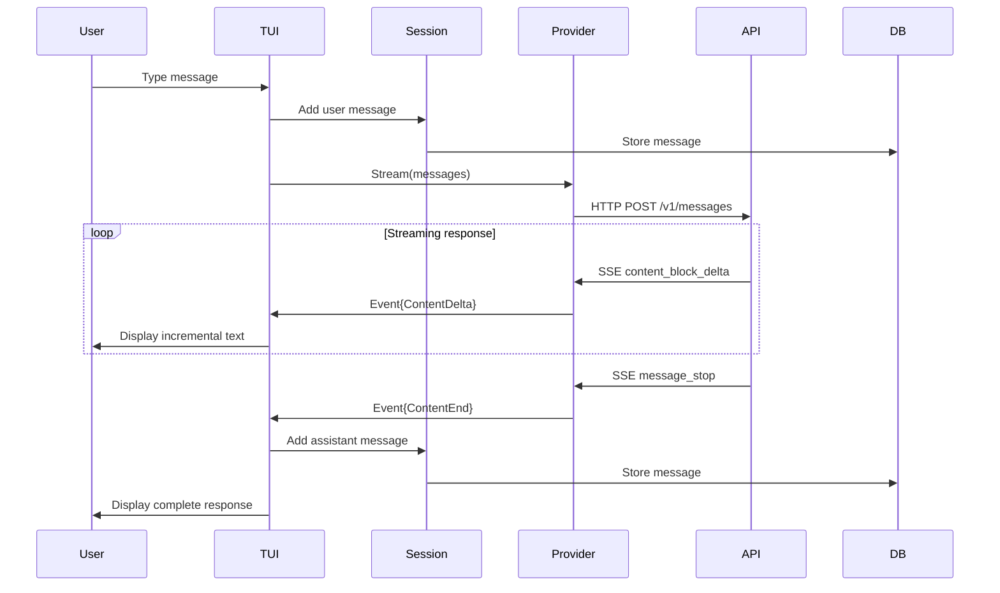
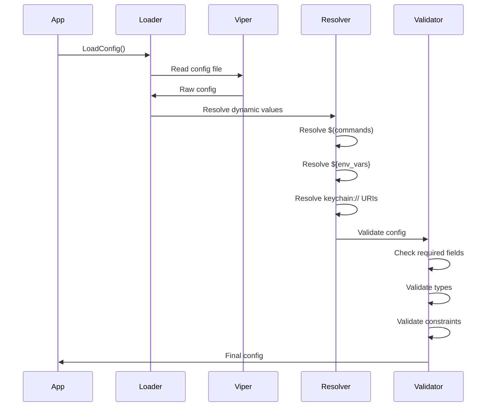

# Architecture Guide

## Overview

AINative Code is designed as a modular, extensible AI coding assistant with clean separation of concerns. The architecture follows Go best practices with a focus on testability, maintainability, and extensibility.

## High-Level Architecture



## Component Architecture

### 1. CLI and Command Layer



**Responsibilities**:
- Parse command-line arguments and flags
- Initialize application configuration
- Route commands to appropriate handlers
- Handle global flags (verbose, config path, etc.)

**Key Files**:
- `cmd/ainative-code/main.go` - Application entry point
- `internal/cmd/*.go` - Command implementations

### 2. Configuration Management

```mermaid
graph TB
    USER[User] --> |edits| CONFIG_FILE[~/.config/ainative-code/config.yaml]
    USER --> |sets env| ENV_VARS[Environment Variables]
    USER --> |uses| CLI_FLAGS[CLI Flags]

    CONFIG_FILE --> LOADER[Config Loader<br/>internal/config/loader.go]
    ENV_VARS --> RESOLVER[Config Resolver<br/>internal/config/resolver.go]
    CLI_FLAGS --> LOADER

    LOADER --> VIPER[Viper]
    VIPER --> RESOLVER

    RESOLVER --> |resolves $(cmd)| CMD_RESOLVER[Command Resolution]
    RESOLVER --> |resolves ${VAR}| ENV_RESOLVER[Environment Resolution]
    RESOLVER --> |resolves keychain| KEYCHAIN_RESOLVER[Keychain Resolution]

    CMD_RESOLVER --> FINAL[Final Configuration]
    ENV_RESOLVER --> FINAL
    KEYCHAIN_RESOLVER --> FINAL

    FINAL --> VALIDATOR[Config Validator<br/>internal/config/validator.go]
    VALIDATOR --> |validates| APP_CONFIG[Application Config]
```

**Features**:
- Multi-layer configuration (file, env, flags)
- Dynamic value resolution (commands, env vars, keychain)
- Validation and defaults
- Hot-reload support with fsnotify

**Key Files**:
- `internal/config/loader.go` - Configuration loading
- `internal/config/resolver.go` - Dynamic value resolution
- `internal/config/validator.go` - Configuration validation
- `internal/config/types.go` - Configuration structs

### 3. Provider Architecture



**Provider Interface**:
```go
type Provider interface {
    Chat(ctx context.Context, messages []Message, opts ...ChatOption) (Response, error)
    Stream(ctx context.Context, messages []Message, opts ...StreamOption) (<-chan Event, error)
    Name() string
    Models() []string
    Close() error
}
```

**Key Design Patterns**:
- **Interface Segregation**: Minimal, focused interface
- **Factory Pattern**: Provider registry for creation
- **Options Pattern**: Flexible configuration with functional options
- **Strategy Pattern**: Interchangeable provider implementations

**Key Files**:
- `internal/provider/provider.go` - Provider interface
- `internal/provider/options.go` - Options builders
- `internal/provider/registry.go` - Provider factory
- `internal/provider/anthropic/provider.go` - Anthropic implementation

### 4. Tool System Architecture



**Tool Interface**:
```go
type Tool interface {
    Name() string
    Description() string
    Schema() ToolSchema
    Execute(ctx context.Context, input map[string]interface{}) (string, error)
}
```

**Key Files**:
- `internal/tools/interface.go` - Tool interface
- `internal/tools/registry.go` - Tool registry
- `internal/tools/validator.go` - Input validation
- `internal/tools/builtin/*.go` - Built-in tools

### 5. Authentication Flow



**Key Components**:
- **JWT Handler**: Token parsing and validation
- **OAuth Handler**: OAuth 2.0 flow implementation
- **Refresh Handler**: Automatic token refresh
- **Keychain**: Secure credential storage
- **Local Auth**: Offline mode support

**Key Files**:
- `internal/auth/jwt/parser.go` - JWT parsing and validation
- `internal/auth/oauth/flow.go` - OAuth flow implementation
- `internal/auth/refresh/refresh.go` - Token refresh logic
- `internal/auth/keychain/keychain.go` - Secure storage

### 6. TUI Architecture



**Bubble Tea Pattern**:
```go
type Model struct {
    viewport    viewport.Model
    messages    []Message
    input       textinput.Model
    spinner     spinner.Model
    // ... state
}

func (m Model) Update(msg tea.Msg) (tea.Model, tea.Cmd)
func (m Model) View() string
```

**Key Files**:
- `internal/tui/model.go` - Main TUI model
- `internal/tui/update.go` - Update logic
- `internal/tui/view.go` - Rendering logic
- `internal/tui/styles.go` - Visual styling

### 7. Database and Session Management



**Schema**:
```sql
CREATE TABLE conversations (
    id TEXT PRIMARY KEY,
    title TEXT,
    created_at INTEGER,
    updated_at INTEGER
);

CREATE TABLE messages (
    id TEXT PRIMARY KEY,
    conversation_id TEXT,
    role TEXT,
    content TEXT,
    created_at INTEGER,
    FOREIGN KEY (conversation_id) REFERENCES conversations(id)
);
```

**Key Files**:
- `internal/database/db.go` - Database initialization
- `internal/database/migrations/*.sql` - Schema migrations
- `internal/session/manager.go` - Session management

## Design Patterns

### 1. Interface-Based Design

All major components are defined by interfaces:
- Enables testing with mocks
- Supports multiple implementations
- Facilitates dependency injection

```go
// Example: Provider interface allows multiple LLM implementations
type Provider interface {
    Chat(...) (Response, error)
    Stream(...) (<-chan Event, error)
}
```

### 2. Options Pattern

Flexible configuration using functional options:

```go
// Example: Chat options
func WithMaxTokens(tokens int) ChatOption
func WithTemperature(temp float64) ChatOption

provider.Chat(ctx, messages,
    WithMaxTokens(4096),
    WithTemperature(0.7),
)
```

### 3. Registry Pattern

Dynamic component registration and discovery:

```go
// Example: Provider registry
registry := provider.NewRegistry()
registry.Register("anthropic", anthropicProvider)
p := registry.Get("anthropic")
```

### 4. Middleware Pattern

Request processing pipeline:

```go
// Example: Auth middleware
func WithAuth(handler http.Handler) http.Handler
func WithRateLimit(handler http.Handler) http.Handler
```

### 5. Repository Pattern

Data access abstraction:

```go
// Example: Session repository
type SessionRepository interface {
    Save(session *Session) error
    Load(id string) (*Session, error)
    Delete(id string) error
}
```

## Data Flow

### Chat Request Flow



### Configuration Loading Flow



## Package Responsibilities

### Core Packages

| Package | Responsibility | Dependencies |
|---------|---------------|--------------|
| `cmd/ainative-code` | CLI entry point, command routing | `internal/cmd`, `cobra` |
| `internal/cmd` | Command implementations | All internal packages |
| `internal/config` | Configuration management | `viper`, `fsnotify` |
| `internal/provider` | LLM provider abstraction | None (interface) |
| `internal/tools` | Tool system | None (interface) |
| `internal/auth` | Authentication & authorization | `golang-jwt`, `keychain` |
| `internal/tui` | Terminal user interface | `bubbletea`, `lipgloss` |
| `internal/logger` | Structured logging | `zerolog` |
| `internal/database` | SQLite persistence | `modernc.org/sqlite` |
| `internal/session` | Session management | `internal/database` |
| `internal/client` | Platform API clients | `internal/auth` |
| `internal/errors` | Error types and handling | None |

### Provider Implementations

| Package | Responsibility |
|---------|---------------|
| `internal/provider/anthropic` | Anthropic Claude integration |
| `internal/provider/mock` | Testing mock provider |

### Authentication Modules

| Package | Responsibility |
|---------|---------------|
| `internal/auth/jwt` | JWT parsing and validation |
| `internal/auth/oauth` | OAuth 2.0 flow |
| `internal/auth/refresh` | Token refresh logic |
| `internal/auth/keychain` | Secure credential storage |
| `internal/auth/local` | Offline authentication |

### Platform Clients

| Package | Responsibility |
|---------|---------------|
| `internal/client/zerodb` | ZeroDB API client |
| `internal/client/strapi` | Strapi CMS client |
| `internal/client/design` | Design tokens client |
| `internal/client/rlhf` | RLHF feedback client |

## Error Handling Strategy

### Error Types

```go
// Custom error types
type ProviderError struct {
    Provider string
    Code     string
    Message  string
    Cause    error
}

type ValidationError struct {
    Field   string
    Message string
}

type AuthError struct {
    Type    AuthErrorType
    Message string
}
```

### Error Wrapping

```go
// Error wrapping for context
if err := provider.Chat(...); err != nil {
    return fmt.Errorf("failed to get chat response from %s: %w",
        provider.Name(), err)
}
```

### Error Recovery

```go
// Graceful degradation
func (p *Provider) ChatWithRetry(ctx context.Context, messages []Message) (Response, error) {
    for attempt := 0; attempt < maxRetries; attempt++ {
        resp, err := p.Chat(ctx, messages)
        if err == nil {
            return resp, nil
        }

        if !isRetryable(err) {
            return Response{}, err
        }

        time.Sleep(backoff(attempt))
    }
    return Response{}, ErrMaxRetriesExceeded
}
```

## Concurrency Model

### Goroutine Usage

```go
// Streaming response handling
func (p *Provider) Stream(ctx context.Context, messages []Message) (<-chan Event, error) {
    events := make(chan Event, 10) // Buffered channel

    go func() {
        defer close(events)
        // Stream processing in background goroutine
        for chunk := range responseStream {
            select {
            case events <- chunk:
            case <-ctx.Done():
                return
            }
        }
    }()

    return events, nil
}
```

### Context Propagation

All operations accept `context.Context` for:
- Cancellation
- Timeouts
- Request-scoped values (request ID, user ID)

```go
ctx, cancel := context.WithTimeout(context.Background(), 30*time.Second)
defer cancel()

response, err := provider.Chat(ctx, messages)
```

## Testing Architecture

### Test Organization

```
internal/provider/
├── provider.go          # Interface
├── provider_test.go     # Interface tests
├── options_test.go      # Options tests
├── anthropic/
│   ├── provider.go      # Implementation
│   └── provider_test.go # Unit tests
└── mock/
    └── provider.go      # Mock for testing
```

### Testing Patterns

1. **Table-Driven Tests**: For comprehensive test coverage
2. **Mock Providers**: For testing without external dependencies
3. **Integration Tests**: For end-to-end validation
4. **Benchmark Tests**: For performance regression detection

See [Testing Guide](testing.md) for details.

## Security Considerations

### Credential Storage

- Sensitive credentials stored in OS keychain
- API keys never logged or displayed
- Tokens encrypted at rest

### Input Validation

- All user input validated and sanitized
- SQL injection prevention with parameterized queries
- Command injection prevention with argument escaping

### Network Security

- TLS for all external API calls
- Certificate validation enforced
- Timeout protection on all HTTP requests

## Performance Characteristics

### Benchmarks

Typical performance on Apple M3:

| Operation | Time | Allocations |
|-----------|------|-------------|
| Logger (simple) | 2.0 μs | 0 allocs |
| Config load | ~10 ms | Minimal |
| Provider stream | ~100-500 ms TTFB | Streaming |
| Database query | ~100 μs | Minimal |

### Optimization Strategies

- Minimal allocations in hot paths
- Connection pooling for HTTP clients
- Caching for frequently accessed data
- Lazy initialization where appropriate

## Extensibility Points

1. **Custom Providers**: Implement `Provider` interface
2. **Custom Tools**: Implement `Tool` interface
3. **Custom Auth**: Implement auth handlers
4. **Custom Storage**: Implement storage backends
5. **Custom UI**: Replace TUI with alternative interface

## Future Architecture Considerations

### Planned Improvements

- Plugin system for third-party extensions
- gRPC support for remote tool execution
- Multi-tenancy support
- Horizontal scaling for server mode
- Metrics and observability integration

### Migration Paths

- Backward compatibility for configuration
- Database migration system in place
- API versioning for breaking changes

## References

- [Go Code Review Comments](https://github.com/golang/go/wiki/CodeReviewComments)
- [Effective Go](https://golang.org/doc/effective_go.html)
- [Bubble Tea Documentation](https://github.com/charmbracelet/bubbletea)
- [OAuth 2.0 Specification](https://oauth.net/2/)

---

**Last Updated**: 2025-01-05
