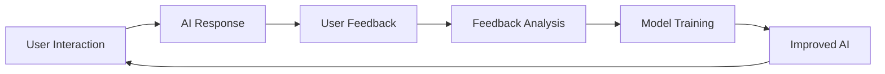

# RLHF Feedback Integration Guide

## Overview

Reinforcement Learning from Human Feedback (RLHF) is a critical system for improving AI agent performance. This guide covers how to collect, submit, and analyze feedback to help train and improve the AINative Code AI assistant.

## Table of Contents

1. [Understanding RLHF](#understanding-rlhf)
2. [Quick Start](#quick-start)
3. [Feedback Types](#feedback-types)
4. [Collecting Feedback](#collecting-feedback)
5. [Best Practices](#best-practices)
6. [Feedback Analytics](#feedback-analytics)
7. [Privacy and Security](#privacy-and-security)
8. [Integration Examples](#integration-examples)
9. [Troubleshooting](#troubleshooting)

## Understanding RLHF

### What is RLHF?

RLHF (Reinforcement Learning from Human Feedback) is a machine learning technique that uses human feedback to improve AI model performance. Your feedback helps the AI:

- Generate better responses
- Understand context more accurately
- Provide more relevant code examples
- Follow instructions more precisely
- Avoid common mistakes

### Why Your Feedback Matters

Every piece of feedback contributes to:

1. **Model Training**: Feedback is used to fine-tune the AI model
2. **Quality Improvement**: Helps identify and fix recurring issues
3. **Feature Development**: Guides development of new capabilities
4. **User Experience**: Improves interaction patterns and response quality

### Feedback Loop



## Quick Start

### Enable RLHF Feedback

```bash
# Configure RLHF endpoint
export RLHF_ENABLED=true

# Verify configuration
ainative-code config get services.rlhf.enabled
```

### Submit Your First Feedback

**Using Slash Command:**

```bash
/zerodb-rlhf-feedback
```

**Using MCP Tool:**

```javascript
mcp__ainative-zerodb__zerodb_rlhf_agent_feedback({
  "agent_id": "ainative-code",
  "feedback_type": "thumbs_up",
  "comment": "Great code example with clear explanation",
  "context": {
    "interaction_id": "int-123",
    "message_id": "msg-456"
  }
})
```

## Feedback Types

### 1. Thumbs Up/Down (Binary Feedback)

**When to use:**
- Quick response quality indicator
- Simple like/dislike for answers
- Fast feedback during conversations

**Examples:**

```javascript
// Thumbs up
mcp__ainative-zerodb__zerodb_rlhf_agent_feedback({
  "agent_id": "ainative-code",
  "feedback_type": "thumbs_up",
  "comment": "Perfect solution, worked immediately",
  "context": {
    "interaction_id": "int-123",
    "task": "debug authentication"
  }
})

// Thumbs down
mcp__ainative-zerodb__zerodb_rlhf_agent_feedback({
  "agent_id": "ainative-code",
  "feedback_type": "thumbs_down",
  "comment": "Code had syntax errors",
  "context": {
    "interaction_id": "int-124",
    "task": "generate API endpoint"
  }
})
```

### 2. Rating (1-5 Scale)

**When to use:**
- Nuanced quality assessment
- Comparing multiple responses
- Detailed evaluation

**Rating Scale:**
- **5 stars**: Exceptional - Perfect response, exceeded expectations
- **4 stars**: Good - Correct and helpful
- **3 stars**: Adequate - Acceptable but could be better
- **2 stars**: Poor - Partially correct or incomplete
- **1 star**: Very Poor - Incorrect or unhelpful

**Example:**

```javascript
mcp__ainative-zerodb__zerodb_rlhf_agent_feedback({
  "agent_id": "ainative-code",
  "feedback_type": "rating",
  "rating": 5,
  "comment": "Comprehensive explanation with multiple approaches and best practices",
  "context": {
    "interaction_id": "int-125",
    "task": "explain OAuth flow",
    "response_quality": {
      "accuracy": 5,
      "completeness": 5,
      "clarity": 5,
      "code_quality": 5
    }
  }
})
```

### 3. Correction Feedback

**When to use:**
- AI provided incorrect information
- Code has bugs or errors
- Need to provide correct answer

**Example:**

```javascript
mcp__ainative-zerodb__zerodb_rlhf_agent_feedback({
  "agent_id": "ainative-code",
  "feedback_type": "correction",
  "comment": "The suggested import is incorrect",
  "context": {
    "interaction_id": "int-126",
    "incorrect_response": "import 'package:http/http.dart' as http;",
    "correct_response": "import 'package:http/http.dart';",
    "explanation": "In Dart, this package should be imported without alias for standard use"
  }
})
```

### 4. Preference Feedback

**When to use:**
- Comparing multiple AI responses
- Indicating preferred approach
- Highlighting better alternatives

**Example:**

```javascript
mcp__ainative-zerodb__zerodb_rlhf_agent_feedback({
  "agent_id": "ainative-code",
  "feedback_type": "preference",
  "comment": "Preferred response A over response B",
  "context": {
    "interaction_id": "int-127",
    "response_a": "Used async/await pattern",
    "response_b": "Used callbacks",
    "preferred": "response_a",
    "reason": "More readable and modern syntax"
  }
})
```

## Collecting Feedback

### Interactive Feedback During Chat

**Method 1: Direct Command**

```bash
ainative-code chat
```

```
User: How do I set up authentication?

AI: Here's how to set up authentication:
[provides detailed explanation]

User: /feedback thumbs_up This is perfect!
AI: ✓ Thank you for the feedback! This helps improve my responses.
```

**Method 2: Inline Feedback**

```
User: Explain async/await in Go

AI: [provides explanation]

User: /feedback rating:5 comment:"Great explanation with examples"
AI: ✓ Feedback recorded. Thank you!
```

### Programmatic Feedback

**Python Example:**

```python
import requests

def submit_feedback(interaction_id, feedback_type, rating=None, comment=None):
    feedback_data = {
        "agent_id": "ainative-code",
        "feedback_type": feedback_type,
        "context": {
            "interaction_id": interaction_id
        }
    }

    if rating:
        feedback_data["rating"] = rating

    if comment:
        feedback_data["comment"] = comment

    response = requests.post(
        "https://api.ainative.studio/v1/rlhf/feedback",
        json=feedback_data,
        headers={
            "Authorization": f"Bearer {api_key}",
            "Content-Type": "application/json"
        }
    )

    return response.json()

# Usage
submit_feedback(
    interaction_id="int-123",
    feedback_type="thumbs_up",
    comment="Excellent code example"
)
```

**Node.js Example:**

```javascript
async function submitFeedback(interactionId, feedbackType, options = {}) {
  const feedbackData = {
    agent_id: 'ainative-code',
    feedback_type: feedbackType,
    rating: options.rating,
    comment: options.comment,
    context: {
      interaction_id: interactionId,
      ...options.context
    }
  };

  const response = await fetch('https://api.ainative.studio/v1/rlhf/feedback', {
    method: 'POST',
    headers: {
      'Authorization': `Bearer ${process.env.AINATIVE_API_KEY}`,
      'Content-Type': 'application/json'
    },
    body: JSON.stringify(feedbackData)
  });

  return response.json();
}

// Usage
await submitFeedback('int-123', 'rating', {
  rating: 5,
  comment: 'Perfect solution',
  context: {
    task: 'database query optimization'
  }
});
```

### Batch Feedback Submission

```javascript
async function submitBatchFeedback(feedbackList) {
  const responses = await Promise.all(
    feedbackList.map(feedback =>
      mcp__ainative_zerodb__zerodb_rlhf_agent_feedback(feedback)
    )
  );

  console.log(`Submitted ${responses.length} feedback items`);
  return responses;
}

// Usage
const feedbackBatch = [
  {
    agent_id: "ainative-code",
    feedback_type: "thumbs_up",
    comment: "Great response 1"
  },
  {
    agent_id: "ainative-code",
    feedback_type: "rating",
    rating: 4,
    comment: "Good response 2"
  }
];

await submitBatchFeedback(feedbackBatch);
```

## Best Practices

### 1. Be Specific

```javascript
// Good: Specific feedback
{
  "feedback_type": "correction",
  "comment": "The SQL query has a syntax error. Missing closing parenthesis on line 3.",
  "context": {
    "line_number": 3,
    "error_type": "syntax"
  }
}

// Bad: Vague feedback
{
  "feedback_type": "thumbs_down",
  "comment": "wrong"
}
```

### 2. Provide Context

```javascript
// Good: Rich context
{
  "feedback_type": "rating",
  "rating": 5,
  "comment": "Excellent explanation of React hooks with practical examples",
  "context": {
    "interaction_id": "int-123",
    "task": "explain useState hook",
    "user_experience_level": "intermediate",
    "response_aspects": {
      "code_quality": 5,
      "explanation_clarity": 5,
      "examples_usefulness": 5
    }
  }
}

// Bad: No context
{
  "feedback_type": "rating",
  "rating": 5
}
```

### 3. Be Constructive

```javascript
// Good: Constructive criticism
{
  "feedback_type": "thumbs_down",
  "comment": "The code works but could be more efficient. Consider using a hash map instead of nested loops for O(n) complexity.",
  "context": {
    "suggestion": "Use Map for lookups instead of Array.find()",
    "performance_impact": "high"
  }
}

// Bad: Unhelpful criticism
{
  "feedback_type": "thumbs_down",
  "comment": "bad code"
}
```

### 4. Regular Feedback

```javascript
// Create a habit of providing feedback
// After each significant interaction

class FeedbackManager {
  constructor() {
    this.pendingFeedback = [];
  }

  addFeedback(interactionId, type, options) {
    this.pendingFeedback.push({
      interaction_id: interactionId,
      feedback_type: type,
      timestamp: new Date(),
      ...options
    });
  }

  async submitPending() {
    if (this.pendingFeedback.length === 0) return;

    await submitBatchFeedback(this.pendingFeedback);
    this.pendingFeedback = [];
    console.log('✓ Feedback submitted');
  }
}

// Usage
const feedbackMgr = new FeedbackManager();

// After interaction 1
feedbackMgr.addFeedback('int-123', 'thumbs_up', {
  comment: 'Great explanation'
});

// After interaction 2
feedbackMgr.addFeedback('int-124', 'rating', {
  rating: 4,
  comment: 'Good but missing edge cases'
});

// Submit at end of session
await feedbackMgr.submitPending();
```

### 5. Categorize Feedback

```javascript
const FeedbackCategory = {
  CODE_QUALITY: 'code_quality',
  EXPLANATION: 'explanation',
  ACCURACY: 'accuracy',
  COMPLETENESS: 'completeness',
  PERFORMANCE: 'performance',
  SECURITY: 'security'
};

function submitCategorizedFeedback(interactionId, category, feedback) {
  return mcp__ainative_zerodb__zerodb_rlhf_agent_feedback({
    agent_id: "ainative-code",
    feedback_type: feedback.type,
    rating: feedback.rating,
    comment: feedback.comment,
    context: {
      interaction_id: interactionId,
      category: category,
      tags: feedback.tags
    }
  });
}

// Usage
submitCategorizedFeedback('int-125', FeedbackCategory.CODE_QUALITY, {
  type: 'thumbs_up',
  comment: 'Clean, well-structured code following best practices',
  tags: ['best-practices', 'clean-code', 'maintainable']
});
```

## Feedback Analytics

### Viewing Your Feedback History

```bash
# List recent feedback
ainative-code rlhf list

# Filter by type
ainative-code rlhf list --type thumbs_up

# Filter by date range
ainative-code rlhf list --since 2024-01-01 --until 2024-01-31

# Filter by rating
ainative-code rlhf list --rating 1-2  # Low ratings
```

### Feedback Statistics

```bash
ainative-code rlhf stats
```

**Output:**

```
RLHF Feedback Statistics
========================

Total Feedback: 145

Breakdown by Type:
  Thumbs Up: 89 (61%)
  Thumbs Down: 12 (8%)
  Ratings: 34 (23%)
  Corrections: 7 (5%)
  Preferences: 3 (2%)

Average Rating: 4.2/5

Most Common Tags:
  - code-quality: 45
  - explanation: 34
  - examples: 28
  - accuracy: 23

Top Categories:
  - Code Quality: 58
  - Explanation Clarity: 47
  - Completeness: 40
```

### Programmatic Access

```javascript
async function getFeedbackStats(agentId, dateRange) {
  const stats = await mcp__ainative_zerodb__zerodb_rlhf_summary({
    agent_id: agentId,
    from_date: dateRange.from,
    to_date: dateRange.to
  });

  return {
    totalFeedback: stats.total_count,
    averageRating: stats.average_rating,
    breakdown: stats.feedback_breakdown,
    topIssues: stats.top_issues,
    improvementAreas: stats.improvement_areas
  };
}

// Usage
const stats = await getFeedbackStats('ainative-code', {
  from: '2024-01-01',
  to: '2024-01-31'
});

console.log(`Average Rating: ${stats.averageRating}/5`);
console.log(`Total Feedback: ${stats.totalFeedback}`);
```

## Privacy and Security

### Data Handling

**What is collected:**
- Feedback type (thumbs up/down, rating, etc.)
- Comments and suggestions
- Interaction context (anonymized)
- Timestamp

**What is NOT collected:**
- Personal identifiable information (PII)
- Private code or proprietary data
- API keys or credentials
- File contents (unless explicitly included)

### Anonymization

All feedback is automatically anonymized:

```javascript
// Before anonymization
{
  "user_id": "user-123",
  "email": "john@company.com",
  "code": "const API_KEY = 'sk-12345';"
}

// After anonymization
{
  "user_id": "anon-hash-abc",
  "code": "const API_KEY = '[REDACTED]';"
}
```

### Data Retention

- Feedback stored for 2 years
- Aggregated statistics kept indefinitely
- Individual feedback can be deleted anytime

### Deleting Feedback

```bash
# Delete specific feedback
ainative-code rlhf delete --id feedback-123

# Delete all your feedback (requires confirmation)
ainative-code rlhf delete --all --confirm
```

## Integration Examples

### Automated Feedback Collection

```javascript
class AIAssistant {
  constructor() {
    this.conversationHistory = [];
  }

  async askQuestion(question) {
    const response = await this.getAIResponse(question);

    const interaction = {
      id: generateId(),
      question: question,
      response: response,
      timestamp: new Date()
    };

    this.conversationHistory.push(interaction);

    return response;
  }

  async provideFeedback(interactionId, feedback) {
    const interaction = this.conversationHistory.find(
      i => i.id === interactionId
    );

    if (!interaction) {
      throw new Error('Interaction not found');
    }

    // Determine feedback type based on response quality
    let feedbackType = 'thumbs_up';
    let rating = 5;

    if (feedback.isCorrect === false) {
      feedbackType = 'correction';
      rating = 2;
    } else if (feedback.needsImprovement) {
      feedbackType = 'rating';
      rating = 3;
    }

    await mcp__ainative_zerodb__zerodb_rlhf_agent_feedback({
      agent_id: 'ainative-code',
      feedback_type: feedbackType,
      rating: rating,
      comment: feedback.comment,
      context: {
        interaction_id: interactionId,
        question: interaction.question,
        response_length: interaction.response.length
      }
    });
  }
}

// Usage
const assistant = new AIAssistant();

const response = await assistant.askQuestion(
  'How do I implement authentication?'
);

// User reviews and provides feedback
await assistant.provideFeedback(interaction.id, {
  isCorrect: true,
  needsImprovement: false,
  comment: 'Perfect explanation with code examples'
});
```

### Feedback Dashboard

```javascript
async function generateFeedbackDashboard() {
  const stats = await mcp__ainative_zerodb__zerodb_rlhf_summary({
    agent_id: 'ainative-code',
    hours: 168 // Last week
  });

  const dashboard = {
    overview: {
      totalInteractions: stats.total_interactions,
      feedbackRate: stats.feedback_rate,
      averageRating: stats.average_rating
    },
    trends: {
      thumbsUp: stats.thumbs_up_count,
      thumbsDown: stats.thumbs_down_count,
      improvement: stats.improvement_trend
    },
    topIssues: stats.top_issues.slice(0, 5),
    recommendations: stats.improvement_recommendations
  };

  return dashboard;
}

// Generate weekly report
const dashboard = await generateFeedbackDashboard();
console.log(`Average Rating: ${dashboard.overview.averageRating}/5`);
console.log(`Feedback Rate: ${dashboard.overview.feedbackRate}%`);
```

## Troubleshooting

### Feedback Not Submitting

**Problem:** Feedback submission fails

**Solutions:**

```bash
# Check authentication
ainative-code auth whoami

# Verify RLHF is enabled
ainative-code config get services.rlhf.enabled

# Test connection
/zerodb-rlhf-feedback

# Check for rate limiting
# Wait 1 minute and retry
```

### Missing Interaction ID

**Problem:** Don't know interaction ID for feedback

**Solutions:**

```javascript
// Track interaction IDs during conversation
let currentInteractionId = null;

function trackInteraction(response) {
  currentInteractionId = response.interaction_id;
  return response;
}

// Use tracked ID for feedback
await submitFeedback(currentInteractionId, 'thumbs_up');
```

### Feedback Not Appearing in Stats

**Problem:** Submitted feedback not showing in statistics

**Solutions:**

```bash
# Wait for processing (up to 5 minutes)

# Check feedback list
ainative-code rlhf list --limit 10

# Verify submission
# Check for confirmation message

# Re-submit if needed
```

## Next Steps

- [ZeroDB Integration](zerodb-integration.md)
- [Design Token Integration](design-token-integration.md)
- [Strapi CMS Integration](strapi-integration.md)
- [Authentication Setup](authentication-setup.md)

## Resources

- [RLHF Research Papers](https://arxiv.org/abs/2203.02155)
- [Anthropic's RLHF Approach](https://www.anthropic.com/index/rlhf)
- [OpenAI's RLHF Documentation](https://openai.com/research/learning-from-human-feedback)
